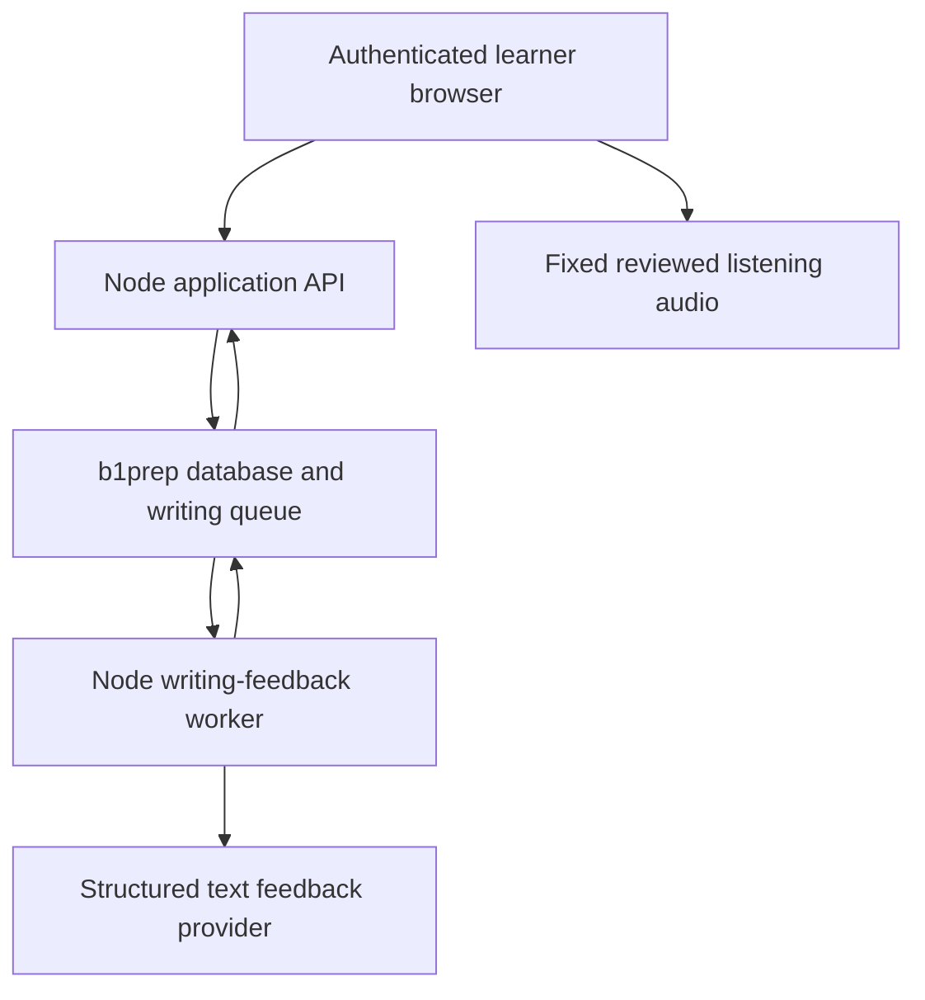

# B1 preparation pilot build plan

## First-release direction — 1 October 2026

**This plan governs scope.** [MASTER-PLAN.md](MASTER-PLAN.md) turns it into delivery order and records progress, and [MFP-DESIGN-DECISIONS.md](work/implementation/MFP-DESIGN-DECISIONS.md) defines the design/state contract. The writing-first `FUNCTIONAL-ROADMAP.md` that previously superseded this section is withdrawn — see [MASTER-PLAN.md](MASTER-PLAN.md) §10. The sections below are the first-release commitment, sequenced to a working **local** application first. Study plans, listening and a full written mock stay in scope, but after that milestone and only behind their review gates.

Build the small new vanilla client from `D:\B1_Prep\design`, with the orange/rising-oo identity, German interface/exam content and de/en/uk/ar/tr explanations. Include script-capable licensed fonts and scoped Arabic RTL for shipping feedback. Ron confirmed the logo was AI-generated for this project. The fourteen-screen inventory is a reference/backlog, not a launch checklist.

Use one shared PostgreSQL schema with session-owned private records and versioned content. Remove local fallback, progress files/blob sync and browser grading through MFP-02b/11; no implicit import into the first account or live data deletion. The internal writing journey must survive fresh-browser resume from server records.

First-release defaults: password plus invite signup, criterion practice grades without a /45 total, no daily-time setting. Resolve R11's three-versus-four rubric contract explicitly. No readiness/streak/study-plan/reminder/purchase UI or unsupported model/storage/retention claims. Pending/failed/unassessed feedback, reset, history/revision, export/delete, legal and error states are required. Objective practice remains conditional MFP-13; broader human review and production authorization gates stay open.

Prepared 30 September 2026 from the current development checkout and the research in this chat.

The [implementation plan](IMPLEMENTATION_PLAN.md) preserves the broader 36-package programme and release gates; the functional roadmap takes precedence for the first-release dependencies, scope and retirement rules. This document retains the product and architecture rationale. Agent assignments and handoffs follow the [workflow](docs/AGENT_WORKFLOW.md) and [board](work/BOARD.md).

The owner has confirmed that employment permission and ownership of the project are verified. Treat those matters as resolved. Following the owner's poor experience with speech features, the pilot now focuses on listening and written exam sections. The product is standalone, self-service exam preparation for people who already have the relevant language foundation. It must work without a school, teacher, class or institutional account. The next milestone is a private pilot in which a learner can sign in, select an exam and date, complete reviewed objective tasks and a writing response, receive appropriately limited feedback and reopen saved work on another device.

## Product scope

Start with telc Deutsch B1, the exam targeted by the existing application. Interpret the written scope as reading, language elements, listening and writing, matching [telc's written examination](https://www.telc.net/sprachpruefungen/deutsch/zertifikat-deutsch-telc-deutsch-b1/). Use a short reviewed diagnostic plus a four-point writing response for the first end-to-end implementation. The product promise is dependable practice for these sections, with native-language explanations and a clear plan to exam day. Explain exam tasks, timing, answer strategies and mistakes; use targeted corrections and revision rather than a general language-course curriculum. If the diagnostic suggests substantial language gaps, state that broader language study may be needed instead of promising that exam practice alone will close them.

The first complete pilot should provide an exam-date study plan, reviewed reading and language-element exercises, fixed listening recordings, structured writing feedback, revision practice and saved progress. Speaking practice and assessment are outside the launch scope. Gate existing speaking routes, menus and oral-score dependencies out of the released product; preserve their source for later evaluation. No microphone, learner recording, transcription or speech-assessment pipeline belongs in this pilot.

Show objective-section marks separately from estimated writing assessment. A short diagnostic is not a full mock. Only offer a written-examination simulation once all included sections, timing and playback rules are reviewed. Do not present a whole-exam score, pass prediction or complete preparation claim while the oral component is unassessed. No teacher dashboard, class assignments or school administration belongs in the launch scope. DTZ, Goethe and any later English examination require their own task and rubric packages. Continue using the existing responsive interface and useful authored exercises.

The owner selected the supplied Hatoove designs to replace the previous logged-in visual language. Apply the shared orange/rising-oo palette, typography, components and layouts throughout the retained learner views, following DESIGN-WIRE-01. Phone and tablet support is required from the first learner flow: test touch navigation, reading space, writing with the onscreen keyboard, audio playback and interrupted-session recovery as well as desktop behavior. Browser viewport checks and actual iPhone Safari/Android Chrome evidence must be distinguished.

The local coordinating agent owns larger architecture, feature and integration work. OpenClaw on Hetzner and Hermes in Docker receive bounded tasks and independent checks through separate clones/worktrees and reviewed PRs. The global concurrency cap is four active agents including coordinator, reviewers, parents and children; Hermes starts with no child budget until verified and explicitly allocated a slot. Product work begins when its dependencies and concrete specification are ready, following the assignment and lease protocol linked above.

The primary commercial hypothesis is a direct-to-learner, fixed-duration exam pass, initially testing an eight-week term. Re-test willingness to pay for the narrower listening and written offer; earlier prices assumed speaking was included. Test individual purchases after the product can safely support multiple users. Schools or other partners may later refer or sponsor learners, but the product and launch revenue model must not depend on that channel. The market, funding and revised cost findings are in [the research memo](research/product-positioning-market-and-costs-2026-09-30.md). Euro price experiments apply to the German pilot and are not a worldwide price list.

## Exam requirements and practice priorities

The official exam specification determines the content and practice plan. For each supported examination, maintain a dated, versioned record of task types, item counts, timing, permitted playback and assistance, answer rules, scoring weights, writing criteria and pass thresholds, with primary-source references. Similar proficiency levels do not make telc, DTZ, Goethe and IELTS interchangeable.

For the current telc Deutsch B1 model, the written components are:

| Component | Published task structure | Maximum points |
|---|---|---:|
| Reading | 5 heading matches, 5 multiple-choice questions, 10 situation/advertisement matches | 75 |
| Language elements | 10 grammar multiple-choice gaps and 10 lexical gaps | 30 |
| Listening | Three parts with 5, 10 and 5 true/false items | 75 |
| Writing | One email response addressing four specified content points | 45 |

Reading and language elements share 90 minutes; listening takes approximately 30 minutes and writing 30 minutes. The model's listening parts permit one, two and two plays respectively. Writing is assessed for task fulfilment, communicative design and formal accuracy: each criterion receives 5, 3, 1 or 0 points and the sum is multiplied by three. These rules come from the [official model examination](https://shop.telc.net/media/catalog/product/file/telc_deutsch_b1_zd_uebungstest_1.pdf), printed pages 5, 14–16 and 36–40, and the [current exam page](https://www.telc.net/sprachpruefungen/deutsch/zertifikat-deutsch-telc-deutsch-b1/). Recheck versions before implementation and release.

Passing the full telc exam requires at least 135/225 written points **and** 45/75 oral points independently. The app can prepare and report on the supported written components; it cannot establish an overall pass while oral performance is unassessed.

Prioritise practice using published scoring importance, the learner's observed errors and the time available. Reading and listening account for two-thirds of the written points. Useful task families include matching every constraint in a situation to an advertisement, recognising paraphrase and negation, distinguishing corrected details in listening, selecting grammar and vocabulary in context, and covering all four writing prompts coherently. These are blueprint-based practice priorities, not claims about which live questions appear most frequently.

For each task family, provide a concise explanation of what earns marks, a reviewed example with distractor explanations, varied independent practice, targeted revision and an unseen timed check. Keep preparation focused on applying the exam requirements rather than memorising one model answer. Native-language explanations support understanding; the task evidence remains in the exam language.

Do not publish "most frequent real exam questions" rankings without an authorised, representative dataset and a stated method. Occurrences in a small public model-test collection describe that collection, not live-exam probability. Use public or licensed material to understand the blueprint and create original reviewed practice; a public download is not blanket permission to republish a question bank. Tag items by task family, tested skill, difficulty, error pattern and source/review status. Use pilot response data to improve practice selection without presenting it as evidence of real-exam question frequency.

## Instruction languages and regional affordability

The product remains test preparation. English listening, reading and writing packages, including a potential Mandarin-supported IELTS Academic package, are expansion candidates. Keep the exam package, exam language, instruction language and purchasing market independent. Adding an instruction language must not change the exam rubric or the learner's score; generate translated explanations from the saved assessment rather than silently regrading an attempt.

Offer reviewed native-language explanations for task requirements, scoring criteria and feedback. Learners answer in the exam language. Guided practice may offer hints and translations; timed mocks follow the exam's language and assistance rules, with native-language feedback afterwards. Distinguish assisted attempts from mock evidence when reporting readiness.

Affordability is a launch requirement in every market. Set and test local-currency prices against comparable local offers, learner budgets and paid conversion. Currency conversion and national income averages alone do not establish an affordable price. Native-language instruction belongs in the core offer; it is not a premium surcharge.

Use a server-controlled price catalogue by market, exam package, pass duration and allowance. The learner's instruction language is not evidence of their purchasing market. Confirm market eligibility through the checkout and billing process, allow correction of location mistakes, and do not use IP location alone. Preserve the purchased price, currency and entitlements for the pass term.

Start with a useful free diagnostic and a prepaid exam pass with a clearly stated writing-review allowance and access to reviewed listening, reading and language-element practice. Test a smaller entry package where upfront cost is a barrier. Price optional human writing review separately. Successful writing assessments consume the allowance; system failures must not charge the learner. Keep assessment standards consistent across regions and tiers. Objective marking uses published answer keys and incurs no LLM grading call.

For each market and sales channel calculate:

**Contribution per pass = collected price - taxes remitted - payment and FX fees - expected refunds and chargebacks - partner commission - writing AI, audio delivery and storage usage - variable support and human review.**

Check this calculation at normal and full included usage, then deduct customer acquisition costs and assess whether sales can cover shared content review, writing validation, authored listening production and platform costs. There is no per-learner transcription or generated examiner voice in the launch budget. Where affordability and sustainable delivery do not overlap, adjust the package, distribution cost or sponsorship arrangement without lowering grading quality. Small payments and top-ups must also be checked for fixed transaction fees.

An initial China benchmark checked on 30 September 2026 is [British Council's official mock-test product page](https://www.chinaielts.org/prepare/ups): it advertises a September 15–October 15 promotion starting at RMB 42.5 and preparation benefits bundled with qualifying exam registrations. This is an advertised entry price, not a verified like-for-like price for our proposed eight-week pass. Compare actual quantities, access periods, feedback and checkout totals before using it to set a price. Exact launch prices for China, India and Vietnam remain unvalidated.

Evaluate local price experiments using paid conversion, meaningful practice completion, refunds, support effort and contribution per acquired learner. Measure acquisition cost by channel rather than assuming that self-service demand is cheap to reach. An individual learner completing their exam is not automatically a retention failure; referrals and later purchases for another exam may matter more than indefinite subscriptions.

## Current baseline

Development checkout: `D:\Hatoove` (relocated 1 October 2026; see [WORKSPACE_LOCATION](docs/WORKSPACE_LOCATION.md)). The installed application on D: is a separate copy; read only the explicitly identified design reference; do not synchronize the installed application into the source repository. Keep learner records separate from source-code changes.

The three offline suites passed on 30 September 2026:

| Command | Result |
|---|---:|
| `node tools/check.js` | 101 passed |
| `node tools/writing-check.js` | 9 passed |
| `node tools/feedback-check.js` | 14 passed |

These 124 checks establish the current offline regression baseline. They do not establish exam accuracy, browser compatibility, deployed security or model quality. The reviewed source baseline now exists in Git (relocated to `D:\Hatoove`); keeping those suites green remains an implementation requirement.

Current source findings supersede stale details in the earlier review:

| Area | Verified current state | Required work |
|---|---|---|
| Writing content points | Generation, validation and offline material already use four | Preserve the fix |
| Writing assessment | Four criteria weighted 15/10/12/8; loosely validated results | Implement the official three-criterion rubric, validate bands and calculate totals deterministically |
| Speaking format | First part is a presentation; parts carry 25/25/25 | Deferred; exclude the feature and oral-score dependencies from the pilot. Correct the task and weights before any future release |
| Speaking evidence | Browser dictation and transcript-based grading; pronunciation already remains unscored | Deferred; no microphone, user recording or STT in the pilot |
| Listening | Browser-generated speech for scored tasks | Serve fixed, reviewed audio recordings |
| Objective marking | Client-side comparison with answer keys | Version tasks, keys and scoring rules; calculate authoritative results on the server |
| Adaptive difficulty | `theta + 8` implies roughly 26% success under the current formula | Derive difficulty from the chosen target success rate and test boundary cases |
| Mock results | Failed writing assessment can become a heuristic numeric mark; written grade band uses the wrong total | Preserve an unassessed state, correct the written-only denominator and remove whole-exam pass claims |
| Hosted service | One progress file, one browser cache key and unauthenticated progress/configuration/AI routes | Add accounts, ownership checks, private persistence and server-controlled assessment endpoints |

Implementation references: `server.js`, `public/js/store.js`, `public/js/blueprint.js`, `public/js/ai.js`, `public/js/engine.js`, `public/js/exam.js`, `public/js/speech.js`, `data/speaking-guide.json` and `data/writing-guide.json`.

The exam corrections follow the [official telc Deutsch B1 model examination](https://shop.telc.net/media/catalog/product/file/telc_deutsch_b1_zd_uebungstest_1.pdf). Have an experienced exam educator review the implemented content and scoring before commercial claims rely on it.

## Proposed deployment architecture

Use one Node codebase for the application API and a background assessment worker. Use the supplied design system in the existing vanilla browser application, with owned server contracts replacing local-only state. The owner already has a DigitalOcean PostgreSQL cluster serving another production application. Prefer reusing that cluster through a separate logical database named `b1prep`, subject to confirming its EU region, capacity and existing permissions. A separate database gives the applications a clearer boundary for migrations, permissions and logical exports than two schemas within the same database. It still shares CPU, memory, storage, connection capacity, maintenance and outages.

Prefer DigitalOcean App Platform for the Node processes in the same EU region and VPC as the database, if the existing cluster passes inspection. Use a maintained authentication library with server-side sessions and object storage for authored listening audio, with authorised delivery where content access is restricted. These functions must be added explicitly; ordinary PostgreSQL does not provide an authentication and storage bundle. Use an ordinary Postgres jobs table for the writing-feedback queue. Keep audio generation and educational review in the content-authoring workflow. No additional database cluster, Redis service, vector database or learner-media upload service is needed for this design at pilot scale.

The actual cluster remains unverified. On 30 September 2026, a read-only `doctl databases list` request using the saved default login returned HTTP 401. Local authentication must be refreshed before inspecting the cluster. No cloud resources, production permissions or firewall rules were changed. Confirm provider processing contracts alongside location; a primary EU region is not a promise that all supplier metadata and support processing stays in the EU.

The browser sends task references, selected answers and written responses. The server determines the learner identity, entitlement, task version, answer keys, model, rubric and limits. It must not accept arbitrary provider URLs, credentials or grading prompts from the learner interface. Objective marking is deterministic; writing criteria require judgement even when totals are calculated deterministically. Validate structured writing output, retain criterion evidence and benchmark estimates against independent human ratings. Save each assessment with its text, model, prompt and rubric versions; reopening it returns that result rather than rerunning the model. Model-provider adapters allow later replacement without changing stored learning evidence.

Adding a logical database to a sufficiently provisioned existing cluster avoids a second cluster bill. This is conditional on spare capacity; it is not a claim that the existing cluster can absorb the pilot. Hosting, authored-audio storage and delivery, email and writing AI usage remain additional costs. Retain $50–100 per month as a provisional early platform budget ceiling for planning, not a verified quote. Replace it with a resource-level estimate after inspection. Protect authored audio independently of database backups and define retention for written learner responses.

Before provisioning, inspect the cluster edition, region, version, tier, recent CPU and memory load, storage growth, peak connections, databases, users, pools, backups and trusted sources. Inspect database permissions separately through SQL when access permits; a cloud resource listing does not establish SQL isolation. Then:

- Give B1 its own runtime and migration roles. The runtime must not use `doadmin`, own the database or have administrative privileges. PostgreSQL roles are shared across the cluster; verify inherited and `PUBLIC` grants before claiming isolation from the other application.
- Scope migrations to the new database and use a small connection pool with capped worker concurrency. Set the actual limits from measured spare capacity.
- Use a private endpoint where supported, with certificate-verified TLS. Preserve existing trusted sources; bulk firewall replacement can remove the other application's access.
- Rehearse B1-only logical recovery. DigitalOcean point-in-time recovery creates a new cluster; recover the B1 database from that restored cluster without rolling back the other application's live data.
- Move B1 to a dedicated cluster when measured resource contention or independent availability requirements justify it.

Provider references: [DigitalOcean users and databases](https://docs.digitalocean.com/products/databases/postgresql/how-to/manage-users-and-databases/), [PostgreSQL database and schema boundaries](https://www.postgresql.org/docs/current/ddl-schemas.html), [App Platform VPC](https://docs.digitalocean.com/products/app-platform/how-to/enable-vpc/), [database network and TLS settings](https://docs.digitalocean.com/products/databases/postgresql/how-to/secure/), [backup restoration](https://docs.digitalocean.com/products/databases/postgresql/how-to/restore-from-backups/).

## First end to end implementation

Build this learner journey first:

1. Sign in as an individual, choose the exam, exam date and instruction language, and start a short reviewed telc B1 written-section diagnostic. No invitation, school affiliation or teacher setup is required.
2. Complete reading and language-element questions; play fixed listening audio and submit the associated answers.
3. Mark objective answers on the server using versioned keys. Save results and present reviewed explanations in the chosen language.
4. Write a response to a reviewed four-point task, with draft recovery. Create a durable feedback job after checking ownership, input limits and entitlement.
5. Request structured writing feedback with the server-owned rubric. Validate criteria and evidence, calculate any permitted total, and save the result or an explicit recoverable failure.
6. Display objective marks separately from estimated writing feedback. Let the learner revise; preserve the original response and assessment as distinct from the revision.
7. Reopen the original and revised work after signing in on another device, and recommend the next reviewed exercise in a manageable plan to the chosen exam date. The learner can follow the plan independently.

Use provider stubs for repeatable local integration tests before enabling live calls. A passing stub test is not evidence of writing-assessment validity. Keep formative feedback distinct from an official exam score. Build a full written simulation only after its complete content, timing, playback and scoring rules are reviewed.

## Implementation milestones

| Order | Deliverable | Completion evidence |
|---|---|---|
| 1 | Reviewed source baseline and written-section package | Curated source in version control; personal records excluded; oral features gated out of the pilot; written task shapes, answer keys and scoring reviewed; historical attempts retain their original rubric |
| 2 | Authentication and owned attempts | Two accounts cannot access each other's records; cache is scoped by account; sign-out clears private state; one saved attempt can be reopened on another device |
| 3 | Reliable listening, reading and language-element practice | Fixed reviewed audio; supported browsers receive the same recording; server-side marking matches reviewed answer keys; interrupted sessions recover |
| 4 | Writing feedback, revisions and trustworthy progress | Complete the first journey above; official writing criteria; interrupted jobs recover; invalid model responses never become scores; writing estimates benchmarked with human raters; deletion survives stale client writes and late jobs |
| 5 | Self-service paid pilot and commercial entitlements | An individual can discover the offer, try the diagnostic, purchase a regional exam pass and practise without staff setup; access has a defined allowance and expiry; payment activation has an audit trail |

Correct the exam package while the account and persistence boundary is being built. Add tests for the educational rules, not merely for the consistency of existing constants.

## Minimal persistent records

- `learner_profiles`: authenticated owner, preferences and exam date.
- `exam_packages`, `rubric_versions`, `content_versions`: immutable references for the exact exercise and scoring rules used.
- `attempts`: owner, task and rubric references, draft, response, revision lineage, mode, assistance used and lifecycle state.
- `content_assets`: authored audio or task illustration, linked content version, object key, checksum, duration where applicable, rights and review status.
- `assessments`: attempt, structured feedback and evidence, model and prompt versions, assessment status.
- `jobs`, `usage_ledger`: processing state, idempotency, retries and actual consumption.
- `products`, `market_prices`, `orders`, `entitlements`: exam pass, purchasing market, agreed price and currency, payment state, allowance and expiry. No school or class model is required at launch.

Use server-verified ownership and database row-level security. Keep privileged worker credentials on the server, with job-to-owner checks. Derive progress summaries from owned attempts rather than trusting browser-supplied final scores or billing counters. Defer institutional roles and permissions until a separately justified future feature needs them.

Legacy progress import should be explicit, previewable and idempotent. Preserve historical scoring labels and evidence; do not silently relabel old results as assessed under the corrected rubric.

## Acceptance checks that protect the pilot

1. **Individual access and isolation:** a learner can enrol and practise without a school account or staff intervention. Learner A and learner B use the same browser and direct API requests. Unauthorised drafts, answers and feedback remain inaccessible; switching accounts does not expose cached private work. Verify payment activation and retries without duplicate entitlements.
2. **Recovery and usage:** interrupt saving and provider calls, refresh and resubmit the same attempt. Preserve the draft and completed answers. The learner receives one completed assessment and one entitlement debit. Record any additional provider usage actually incurred during retries.
3. **Writing integrity:** test missing, malformed, truncated and contradictory provider results. Preserve an explicit unassessed state, exact text/content/rubric/model versions and criterion evidence. Reopening feedback or changing its explanation language must not silently produce another grade. Revisions retain their own lineage.
4. **Objective marking and audio:** hand-reviewed cases cover every task type, blank answers, no-match options and invalid/reused selections. Verify answer keys and totals. Bind each task to a reviewed recording and checksum. Test identical audio across supported browsers, the permitted playback controls and recovery from audio-loading failures without consuming a paid attempt.
5. **Truthful results:** distinguish assistance and practice from exam-mode evidence, use the correct written-section denominator, keep pending writing unassessed and never infer an overall examination pass from missing oral results. Check adaptive difficulty boundaries against the chosen target success rate.
6. **Retention and deletion:** expire retained drafts and written responses according to policy, delete an attempt and exercise stale client writes and delayed jobs. Deleted work must not reappear. Verify recovery of authored content independently from database recovery.

Retain the existing offline suites as regression checks during implementation. Add a real browser test of fixed-audio playback, objective marking, writing feedback, revision and resume. Compare writing estimates with independently rated learner samples, including repeated model runs and translated explanations, before making accuracy or consistency claims. A pinned model and validated schema alone do not establish correct assessment.

## Pilot success evidence

Recruit 50–100 individual near-exam learners once the complete pilot scope is ready, including learners who choose to pay the tested price. Measure diagnostic-to-purchase conversion, independent onboarding and practice completion, audio failures, answer-key defects, writing feedback errors, improvement on unseen tasks, refunds, support effort, acquisition cost and contribution per learner. Re-test prices for this narrower scope. Qualified educators still review content and benchmark writing feedback behind the scenes; the learner does not need a teacher to use the product. Employer permission and project ownership are no longer outstanding milestones.
