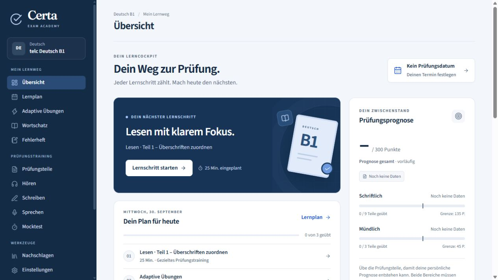

# Learner appearance and mobile acceptance

The user chose the previous learner app's appearance as the foundation after login. Preserve its sidebar, restrained navy/light palette, typography, card spacing, dashboard hierarchy and focused practice screens. Apply Hatoove naming and its preferred oo identity without replacing this interface with the orange public website.

This screenshot records the appearance, not an approved exam specification. Remove speaking from pilot navigation and replace unsupported readiness predictions with observed practice, mistakes and the next useful action. Keep the underlying current source in `public/`; `hatoove-site/dist/` is the public marketing/practice preview. A framework rewrite is not a prerequisite.

## Evidence required for each learner-screen task

- Compare desktop at approximately 1280 px and phone layouts at 320 and 390 px; include a tablet layout around 768 px and text zoom. Record actual viewport/device/browser, screenshots and functional results in the PR.
- Keep navigation, task text, answer controls, audio and the primary action reachable without horizontal clipping. Stack columns and collapse navigation intentionally; preserve readable text and adequately spaced touch controls.
- Writing must remain usable with the onscreen keyboard: caret and feedback stay reachable, sticky controls do not cover the draft, and navigation/reload restores the saved draft.
- Test keyboard navigation, visible focus, labels and feedback announcements. Automated accessibility results complement manual interaction checks.
- Test Arabic RTL UI with embedded German text, numbers, punctuation and audio controls; use native review for comprehension. German exam content must not be reversed by interface direction.
- Before external pilot admission, check iPhone Safari and Android Chrome on actual devices for touch, keyboard, fixed audio loading/playback, interruptions and return to saved work. Browser viewport emulation is separate evidence and cannot close these device checks.

## Current state

The desktop reference was captured during the 30 September 2026 source audit with an empty synthetic learner state. Earlier viewport tests found draft-loss and navigation issues; preserving the visual style does not preserve those defects. This preparation records acceptance criteria only. Responsive product changes, end-to-end recovery and real-device verification remain implementation tasks.
