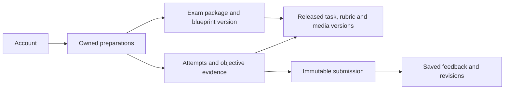
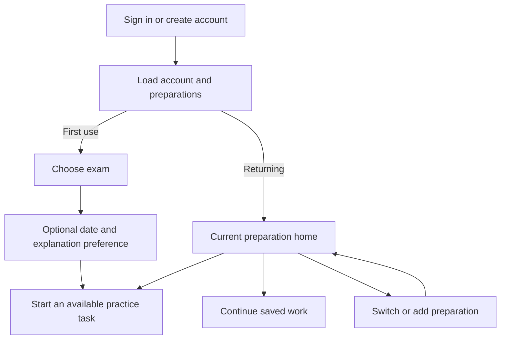

# Multi-exam architecture assessment: telc B1, DTZ and later languages

Execution: **EXAM-ARCH-20261002-A**. Assessed source: **c06a087a7b74d8d25266ec347fa32fa34c27f935**, 2 October 2026. Status: **proposal for review; no application, database or content release changes**. Ron requested an assessment of DTZ alongside telc B1, an account-to-exam-to-practice journey, and maintainable expansion to other language exams.

## Recommendation

Keep one Hatoove application, the vanilla client, the Node server/worker and one shared PostgreSQL schema. Extend the existing exam-package foundation rather than building a separate DTZ application. Separate three concepts explicitly:

1. **The account** owns identity, account preferences and data rights.
2. **A preparation** is that person's work toward a particular exam, with its own date, saved work and history.
3. **A versioned exam package** defines that exam's structure, allowed task types, content references, assessment contracts and actual available features.

One account can hold several preparations. The interface shows one active preparation at a time. A returning learner resumes directly; a first-time learner chooses an exam before seeing practice. A future language is another package, not a translation of German questions or a fork of the application.

The existing database already records exam identities, immutable task/rubric versions and session-derived ownership. However, **adding DTZ rows or a dropdown now is insufficient**: the shipped journey has no exam selection, settings hold one exam date, several queries default to all exams, and client/worker contracts assume telc. Fix those seams before making a second package available.

This proposal does not change the current pilot exclusions: speaking/STT, overall-exam pass predictions, production deployment and live-provider activation remain outside this assessment. The accepted [D9 record](D9-EXAM-PACKAGES.md) names telc English B1 as an expansion candidate, not a promised release. DTZ is the immediate second-package architecture test requested here; this is not approval of its educational content.

## 1. What DTZ changes

The package should be named **Deutsch-Test für Zuwanderer (DTZ), A2–B1**, with B1 selectable as the learner's goal. Do not call the exam itself a B1-only variant. g.a.s.t. administers DTZ; its identity must not depend on an old provider label. Keep exam identity, administrator and historical source provenance separate.

| Property | telc Deutsch B1 | DTZ A2–B1 | Consequence for Hatoove |
|---|---|---|---|
| Level model | B1 | Scaled A2–B1 | Store a level model/range and optional learner goal; never infer exam identity from `B1` alone. |
| Reading | 3 parts, 20 items | 5 parts, 25 items | Section/part definitions and supported task shapes come from the selected blueprint. |
| Language elements | Separate 2-part section, 20 items | No separate section | Do not show a DTZ Sprachbausteine exam tile. General grammar drills can remain labelled supporting practice. |
| Listening | 3 parts, 20 items | 4 parts, 20 items | Bind each set to its own audio and playback rules; do not reuse telc listening assumptions. |
| Playback in the published model | Once, twice, twice across the three parts | Once for each recording | Store playback policy per part and distinguish assisted practice from exam-format playback. |
| Written timing | Reading/language elements share 90 minutes; listening about 30; writing 30 | Listening about 25; reading 45; writing 30 minutes | Model ordered sections and shared time groups, not a universal duration per skill. |
| Writing task | One assigned task with four content points | Choice between two tasks, each with four content points | A practice task may be selected directly; an eventual exam simulation must preserve the A/B choice and selected prompt binding. |
| Writing criteria | 3 criteria | 4 criteria | DTZ needs its own rubric, feedback schema, validation fixtures and educational review. The retired internal four-criterion rubric is not a DTZ rubric. |
| Overall result | Includes oral performance | Includes oral performance | Written practice cannot produce a whole-exam pass prediction for either package. |

Sources: [telc exam overview](https://www.telc.net/sprachpruefungen/deutsch/zertifikat-deutsch-telc-deutsch-b1/), [telc official model](https://shop.telc.net/media/catalog/product/file/telc_deutsch_b1_zd_uebungstest_1.pdf), [g.a.s.t. DTZ overview](https://www.gast.de/de/forschung-entwicklung/entwicklung/auftraege/deutsch-test-fuer-zuwanderer-dtz/der-dtz-auf-einen-blick), [DTZ official practice set 1](https://www.gast.de/fileadmin/gast.de/GAST/5_DTZ/PDF/gast_DTZ_UEbungssatz_1.pdf), [g.a.s.t. FAQ](https://www.gast.de/de/forschung-entwicklung/entwicklung/auftraege/deutsch-test-fuer-zuwanderer-dtz/faq). Source checks are format research, not qualified approval of Hatoove content.

DTZ's writing dimensions are task fulfilment, communicative organisation, accuracy and vocabulary. Preserve their distinct criterion IDs and descriptors. Do not reuse telc bands or convert telc feedback into DTZ results. Display practice feedback without an overall total; any future numeric/level assessment requires its own evaluated contract. Fixed, rights-cleared listening recordings are required before listening is offered. Device-local read-aloud of explanations does not satisfy that requirement.

DTZ adds a concrete renderer requirement: reading part 3 and listening part 3 combine true/false and multiple-choice questions under shared stimuli. Reading part 5 is a six-item multiple-choice cloze, not a separate language-elements section. DTZ writing uses six rubric positions rather than telc's four A–D positions; the [detailed second official practice set, printed pp.42–43](https://www.gast.de/fileadmin/gast.de/GAST/5_DTZ/PDF/gast_DTZ_UEbungssatz_2.pdf#page=42) is the contract source. The current FAQ sets no minimum word count and permits an appropriate, consistent informal address; do not invent a word-count threshold or universal formal-address rule. These facts need assessment fixtures, not just new labels.

Evidence limits: DTZ task structure was cross-checked between official practice sets and current provider pages. The overview's abbreviated writing labels differ from the detailed rubric/FAQ; use the detailed contract. The accessible telc model is the 2020 printed edition, consistent at the broad-format level with its current page. An examiner should confirm delivery-mode details before accepting any simulation. PDF text was checked; independent visual inspection of those tables was not established by this assessment.

## 2. Current architecture: useful foundations and blocking gaps

Paths and line references below refer to the assessed source, not an implemented design.

| Area | Existing foundation | Required change before DTZ activation |
|---|---|---|
| Identity and ownership | Verified sessions, row-level ownership, account-change fencing and durable saved work | Retain those protections; add preparation ownership and account/preparation context to new paths. |
| Package metadata | `server/migrations/0009-exam-scope.sql:23` defines `exam_package`; content, tasks and rubrics carry `exam_id` | Add immutable runtime-validated blueprint versions and an explicit release/availability record. A text `blueprint_version` field is not a validated blueprint contract. |
| Preferences | `server/owned-postgres/settings.mjs:141` reads one account-wide `exam_date` | Move the exam date into preparation records. Keep theme and default explanation preference on the account. |
| Discovery | `server/owned-api.mjs:729` and datastore queries already accept an exam filter | Require explicit preparation context for practice. Null must not silently mean all packages in learner practice or progress. |
| Part vocabulary | `server/owned-api.mjs:202` fixes LV1–3, SB1–2 and HV1–3 | Replace the global telc part parser with package-defined part identities and validation. DTZ reading part 5 must be valid only within its package. |
| Objective progress | `server/owned-postgres/adapter.mjs:548` and `:639` optionally filter exam and aggregate by section | Scope recommendations, mistakes and denominators to preparation/package/version and comparable task definitions. |
| Objective version binding | `public/app/app.js:631` opens by set ID; `public/app/api.js:151` defaults reads to `v1`; adapter seen/mistake keys at `:601` and `:685` omit version | Carry the exact set version from discovery through read and answer. Keep evidence version-specific unless an explicit reviewed equivalence mapping exists. |
| Writing assessment | `server/owned-postgres/worker.mjs:53` resolves only imported telc/legacy rubric constants; `server/worker.mjs:79` uses a deterministic stub | Resolve the exact package/task/rubric and supported assessment policy before grading. Supply the immutable prompt, selected task variant and required descriptors to the grader. Keep live evaluation gates. |
| Feedback validation | Worker validates against bound rubric, but obtains band keys from the first criterion (`:233`) | Validate each criterion against its own scale and schema; unknown policies fail before any provider call. |
| Client | Shared API module and reusable writing controller; fixed telc section names and feedback copy in `public/app/app.js:45` and `:791` | Introduce exam context, catalogue-driven navigation, renderer registry and rubric-specific display metadata. |
| Entry | `public/auth/entry.js:110` redirects to `/app/` | Bootstrap saved preparations; choose exam on first use and resume on later visits. |
| Practice entry actions | `public/app/app.js:275` and `:403` show informational writing/recommendation cards without a direct start action | Make Start/Continue open the exact available versioned task. A chooser followed by an inert card would still leave the requested journey incomplete. |
| Content maintenance | Reproducible generators such as `tools/build-objective-migration.mjs` split public content from private keys | Standardise a package manifest/import pipeline; ordinary new questions should not require hand-editing application code or one schema migration per content batch. |
| Publication and withdrawal | `server/content-policy.mjs:2` defaults to approved plus unreviewed generated material; `0020-content-rights.sql:24` permits one immutable rights decision per content version | Add explicit package/section release gates and append-only decision identities so later review or revocation is possible. Seeding DTZ must not publish it. |
| Reference resources | Vocabulary/noun/guide schemas in migrations 0011–0013 contain language-specific shapes and limited versioning | Introduce versioned language-tagged resources incrementally; German noun gender is not a universal exam feature. |

These are second-package launch blockers, not a claim that a second exam is currently leaking another account's data. The current single-package pilot remains unchanged.

## 3. Recommended data boundaries

Use relational columns for identity, ownership, version references, availability and query filters. Use validated JSON payloads for task-specific stimuli and responses. Do not turn the schema into one unvalidated content blob or create a database/schema per exam.

| Concept | Responsibility and invariants |
|---|---|
| `exam_package` (extend existing) | Stable exam ID, official name/aliases, administrator, exam language and level model. Names are display data, not keys. Support fixed CEFR levels, CEFR ranges and future band-scale exams without pretending every test is B1. |
| `exam_package_version` (new) | Immutable blueprint, source revision, ordered sections/parts/time groups, task-type contracts, assessment policy versions and declared supported scope. Explicit compatibility version. |
| Package/content release records (new) | Which reviewed version and content inventory are offered to which environment/audience; section readiness and withdrawal. Keep mutable publication state or append-only release decisions outside immutable task bodies. |
| `learner_preparation` (new, owned) | Account ID, exam ID and blueprint version, optional target level, local calendar exam date, lifecycle state and optimistic revision. A preparation can be archived without deleting work. Start with one open preparation per account/exam; retain an ID so retakes can later be separate cycles. A date alone needs no timezone; add one only if scheduling an actual time becomes a requirement. |
| Account preferences (extend existing) | Theme, default explanation language, future interface locale and last-used preparation hint. Last-used is navigation convenience, never the authority for an existing attempt. |
| Existing tasks/sets/rubrics/assets | Exact immutable versions bound to their exam and blueprint. Stable globally unique IDs or namespaced IDs; composite foreign keys/checks must prevent cross-exam task/rubric/content combinations. |
| Existing attempts/evidence/submissions/results | Add preparation association and authoritative package binding. Each attempt retains exact task, rubric, policy, content/media and blueprint versions; submissions retain exact text and explanation language. |
| Translations/reference resources | Language-specific versions and review status. Reusable German grammar can be tagged for applicable packages; its completion is not automatically counted as exam-part performance. |



Keep these choices independent: **exam**, **exam language**, **interface language**, **explanation language**, **purchasing market**. German remains the current interface language; adding DTZ does not authorise a full multilingual-shell project. Existing de/en/uk/ar/tr explanation preferences remain separate, with scoped Arabic RTL. Changing an explanation preference never changes the exam or silently regrades an old submission. A future market/currency decision is not inferred from a language or IP address.

A preparation references a blueprint. Compatible new content releases can add practice under that blueprint without rewriting past attempts. A changed exam specification creates a new blueprint version and an explicit upgrade path; it must not alter historical marks or submitted text. Retain a safe historical reader when a task is withdrawn from new practice; exceptional legal takedown rules require their own policy.

Credits/allowances stay a server-owned entitlement concern. Creating or switching preparations must never mint a new free allowance or imply purchase. Current account-wide allowance semantics can remain explicit; any later package-scoped offer is a separate contract.

At the database boundary, consider `UNIQUE(preparation_id, owner_id, exam_id)` with a matching foreign key from new work, plus same-exam task/content/rubric references and the exact task-to-rubric tuple. Preserve existing IDs, including unprefixed historical `writing.*`; namespace new content. Avoid storing duplicate immutable facts when a protected reference already proves them. Use a nullable SQL `date` for the preparation date and calendar-valid input checks; the current settings string regex alone does not reject impossible dates.

## 4. Application and API structure

Use a modular monolith: authentication/accounts, exam catalogue, preparations, practice, assessment and content publishing are code modules within the same deployment. Keep Docker Compose and the current server/worker. Neither microservices, a new framework nor a plugin execution platform is needed.

**Shared practice engine, declarative packages.** A package selects tested capabilities such as single choice, matching, bank gap-fill, inline gap-fill, grouped questions, fixed audio and extended writing. Each renderer/answer schema/marker is versioned and registered in code. Exam-specific IDs and labels map to those capabilities. Packages do not contain executable JavaScript, SQL or arbitrary scoring expressions. A genuinely new interaction type requires a reviewed renderer and server validator; adding more content of a supported type does not.

Carve `public/app/app.js` into bounded vanilla modules as the features are touched: bootstrap/router, preparation context, exam chooser, dashboard, practice catalogue, objective renderer registry, history and preferences. Keep `api.js` as the sole transport owner and retain the writing controller's save/conflict/submission guarantees. Do not rewrite all views first.

Proposed resource shape, to formalise in the API contract before implementation:

| Resource | Purpose |
|---|---|
| `GET /api/v1/bootstrap` | Verified account, preferences, owned preparations and permitted catalogue summary; distinguish empty setup from unavailable service. |
| `GET /api/v1/exams` | Searchable/filterable package summaries, official display names, level model and actual section availability. No answer keys or unapproved hidden content. |
| `POST /api/v1/preparations` | Idempotently create an owned preparation after validating package availability. Session supplies owner; date optional. |
| `GET/PATCH /api/v1/preparations/:id` | Read/update the owned date, goal or archive state using an expected revision. No reassignment of an existing preparation's exam. |
| `/api/v1/preparations/:id/{tasks,practice,next,progress,mistakes,history}` | Explicitly scoped discovery and practice resources; final route names to consolidate with existing routes. Paginated lists. |
| Existing attempt/submission endpoints | IDs resolve ownership, preparation and immutable task binding server-side. No dependence on a global active-exam preference. |

Creation validates the full tuple: preparation owner + package + blueprint + task version + rubric/marker + release policy. An authenticated account alone is not enough to make an arbitrary task valid for the selected preparation. Returning 404 for another owner's preparation must preserve the current non-enumeration contract.

Use explicit route context such as `/app/#/prep/<id>/practice`; existing hash-based deployment needs no hosting migration. A browser tab keeps its own preparation context. The last-used preference helps a fresh browser, but switching in tab A must not retarget tab B's saved draft. Extend the current account-generation fence with a preparation/navigation generation and cancellation of obsolete reads/polls. Server jobs continue against their original immutable submission.

Bootstrap must resolve account and preparation before dispatching a practice view; the current `route()` precedes awaited refresh in `public/app/app.js:1070`. A same-view exam switch needs its own context generation because checking the view name alone cannot reject the old result. An explicit, validated relative deep link wins over the last-used hint after sign-in; do not introduce an arbitrary external return URL. Add cursor pagination and indexes for owner/preparation/time, exam/blueprint/task family and release membership as the corresponding queries are introduced, rather than downloading whole banks for client-side filtering.

Retain the existing verified-session handshake before calling the owned bootstrap endpoint: `createApi` deliberately refuses unbound `/api/v1` requests. Bootstrap is a domain-data read after identity binding, not a way to bypass the account fence.

## 5. Learner experience



**First use:** show two clear cards when both packages are actually available: “telc Deutsch B1” and “DTZ · Deutsch-Test für Zuwanderer · A2–B1”. Explain the distinction briefly. An “Ich bin nicht sicher” link compares the exam names/formats and suggests checking the booking/course documentation; it must not guess an exam from nationality or explanation language. No preselected exam that the learner can miss. Keep the date optional with “Noch kein Termin”. Reuse the account's explanation preference. One “Mit dem Üben beginnen” action creates the preparation and opens an available task or a clear skill choice. Do not require a diagnostic, daily-time setting or study plan.

**Returning learner:** bypass repeated onboarding. The home names the current exam, then gives priority to a saved draft, pending feedback or a clear “Übung starten” action. Saved work and feedback remain easy to reach. Show factual activity only; do not fill the dashboard with readiness, streaks or invented completion percentages.

**Navigation:** a persistent exam name/switcher in the desktop header and mobile header/sheet. Primary destinations remain consistent: Heute, Üben, Verlauf, Mehr. The selected package supplies the skills inside Üben. DTZ has Lesen, Hören and Schreiben; grammar/reference resources appear as supporting practice. Hören is enabled only when reviewed fixed audio is available. An unavailable feature explains its status rather than leading to an empty exercise.

**More exams later:** with two choices use cards, not a search form. As the catalogue grows, progressively add exam-language filters, search and provider/level refinements. Remember enrolled preparations at the top. Do not use country flags as language identifiers, flatten everything into a long dropdown or make a learner select an administrator before seeing a recognisable exam name.

**Switching and recovery:**

- Unsaved writing: save and switch, stay, or explicitly abandon only the local unsaved edits while retaining the last server-saved draft. Switching must not call draft DELETE. A failed save leaves the text visible and the context unchanged; copy recovery remains available.
- A lost save response or revision conflict also leaves the old context visible until resolved. Deleting a saved draft is a separate explicit action; server refusal still wins if another tab has already submitted it. Switching exams never bypasses the submitted-draft preservation rule.
- Submitted writing: keep its original exam label, pending/error status and history. Switching cannot cancel grading, duplicate the debit or reinterpret the rubric.
- Old links and two tabs: open the preparation belonging to the referenced attempt after ownership validation; show that context clearly. Ignore late results from the previous view.
- Archived/withdrawn package: allow historical access according to policy; offer an explicit supported destination for new practice. No silent task substitution.
- Empty or blocked catalogue: distinguish no matching content, unavailable service, unavailable audio and review/access restrictions. Never show a misleading Start button.
- Account export/deletion: describe account-wide scope across all preparations. Archive preparation is a separate reversible action, not account deletion.

Use the supplied orange/warm-paper design system and licensed fonts. `design/screens/onboarding.html` already suggests a useful two-card layout, but its plan/readiness/daily-time claims are excluded. Acceptance includes keyboard focus, screen-reader labels, 320/390px layouts, text zoom, long exam names, light/dark themes, Arabic explanation blocks and actual iPhone/Android keyboard/audio checks. No new UI is claimed by this document.

Keep full objective answer text visible on touch screens; the current 40-character truncation plus hover title (`public/app/app.js:695`) is unsuitable for choosing between long answers. Do not hide the exam name inside a desktop-only sidebar. History defaults to the active preparation; an explicit all-preparations view may group labelled records without aggregating incompatible results. A past exam date invites an optional update and does not block practice. Define save/resume rights for existing drafts when access or publication changes before implementing that recovery state.

## 6. Maintainable content operations

Begin with version-controlled structured source and a validated import command; a bespoke administration CMS is not a prerequisite. Retain the database and API as runtime authority. A future editorial UI should call the same validation/publishing service rather than introduce another data format.

Suggested source organisation:

```text
content/exams/<exam-id>/manifest.json
content/exams/<exam-id>/blueprints/<version>.json
content/exams/<exam-id>/tasks/<family>/<task-id>/<version>.json
content/exams/<exam-id>/rubrics/<rubric-id>/<version>.json
content/exams/<exam-id>/locales/<language>/...
content/exams/<exam-id>/media/manifest.json
```

Keys and transcripts remain private import inputs; they must never enter public assets or learner DTOs. Shared resources have explicit applicability and source identity rather than copied text across packages. Current media support is generic static serving, and `/assets/**` is anonymous. EXAM-05 must design and validate a version-aware media route within the existing Node server, including rights/release/access checks, checksums and appropriate range/playback support. Do not assume those controls already exist or introduce a new hosting service merely for this assessment.

The pipeline is **author → validate → qualified educational review → translation/audio/rights review → preview → publish a content release → monitor or withdraw**. Keep these approvals separate and tied to exact hashes. Agents may draft and validate, not grant educational approval. Public official model PDFs establish specifications, not blanket republication rights.

Validation covers schema/version support, unique identities, all referenced versions, exam/blueprint coherence, answer keys, option/matching constraints, task counts where applicable, rubric criteria/scales, source/rights records, translation coverage, asset existence/hash/duration and accessibility metadata. Publish transactionally using a privileged content publisher, never the learner runtime role. Identical imports are idempotent; different bytes under the same version are rejected. Expose a dry-run diff and audit receipt. Avoid selecting “latest” using lexical version sorting; releases name explicit versions.

Schema migrations remain for schema changes. Preserve all applied historical seed migrations and their checksums. Transition future content batches to the importer without rewriting existing rows, hashes or provenance. Editorial reports should expose coverage by package/section/task family, review status and language, so expanding a corpus is a content operation rather than a hunt through SQL and client code.

## 7. Safe delivery sequence

| Slice | Deliverable | Acceptance before proceeding |
|---|---|---|
| EXAM-01: contracts and blueprint | Reviewed package/preparation/API contracts, DTZ source register, level/section/task/rubric schemas | telc and DTZ fixtures validate as distinct packages; a third synthetic non-German band-scale package exposes hidden B1/German assumptions. No learner exposure. |
| EXAM-02: data and scoped APIs | Forward migrations, preparation ownership, explicit discovery/progress/history context, safe legacy mapping | Two users × two exams with negative cross-binding tests; account-wide export/delete and idempotent creation work on real disposable PostgreSQL. |
| EXAM-03: selection and return journey | Bootstrap, exam cards, optional setup, switcher, exam-specific navigation and saved-work resume | Real API browser journey on desktop/mobile, dirty-draft and delayed-response cases, independent tabs and fresh-browser resume. DTZ remains unavailable until its release gate passes. |
| EXAM-04: package-driven practice | Registered task renderers/validators, exact rubric resolution, grouped DTZ question/choice structures and policy binding | Separate telc/DTZ fixtures mark/render correctly; unsupported contract fails closed before grading. Current telc history remains unchanged. |
| EXAM-05: content and publication | Reproducible importer, original DTZ corpus, qualified reviews, fixed audio, section readiness | Dry-run/import/drift/withdrawal tests; licensed and reviewed assets; no keys/transcripts in learner responses. |
| EXAM-06: full acceptance | End-to-end selection/practice/history and recovery, accessibility, real-device evidence | Independently reviewed source and green relevant CI; qualified content/provider/legal/security gates tracked separately. |

This is substantial cross-cutting work, not a dropdown-sized patch. EXAM-01/02 are the foundation; writing the full DTZ bank before those contracts settle risks expensive rework. Content authoring/review can run alongside later client work once task/rubric schemas are fixed. No time estimate is asserted before that inventory and review capacity are known.

For migration, classify existing records first. Known telc-bound work can map to a telc preparation using its immutable task/evidence identity, with an auditable mapping and preserved date; those learners skip first-time onboarding. Do not assign records based only on a global preference. Ambiguous synthetic/legacy bindings stay explicitly unresolved and readable; never invent an exam or erase them. Empty accounts should still choose their first exam. Use nullable additions/backfill/verification before tightening constraints, transactional writes, a backup and a dry run. Preserve old preference values through the compatibility rollout. If an immutable historical row cannot accept a new binding, use a separately verified mapping record rather than disabling its protection. Rollback means disabling the new selection/release while retaining added data, not dropping learner tables. Test concurrency and idempotence before any live migration.

## 8. Discriminating acceptance tests

1. One learner creates telc and DTZ preparations with different dates. Switching cannot change either date, task list, results or history. Another learner cannot read or mutate them by ID.
2. A DTZ preparation rejects a telc task/rubric, forged exam ID, missing context and unsupported blueprint. Database constraints also reject incompatible content tuples.
3. DTZ reading part 5 is accepted for DTZ and rejected for telc. Mixed task shapes and writing choice persist the exact selected variant.
4. A delayed telc response cannot populate the DTZ screen. Two tabs may practise different exams; changing a last-used hint does not retarget either tab.
5. A dirty draft survives refused/failed switching, session expiry and lost save response. Pending submission continues once and is shown under its original exam with unchanged usage accounting.
6. New package/content versions affect new work only. Old submissions, rubric labels, audio references and feedback remain exact; withdrawn content cannot start a new attempt.
7. Progress and mistakes are isolated per preparation and comparable policy version. No cross-rubric average, overall pass label or grammar-drill-as-exam-completion appears.
8. Changing explanation language preserves German/English exam text and saved assessment identity. Missing translations are explicit; Arabic direction does not leak into the rest of the screen.
9. Importing twice is idempotent; changing bytes under an existing version fails; an incomplete or unreviewed release cannot be enabled by a learner request. Public DTOs contain no keys or protected transcripts.
10. Account export includes all preparations and retained work; hard delete removes all owned rows, revokes sessions and cannot be undone by a late job. Creating a preparation does not replenish credits.
11. A synthetic English band-scale package can be added through manifest/content plus supported capabilities without modifying German core constants. A genuinely new interaction intentionally requires an explicit renderer/validator registration.

All executable checks must use source-only fixtures, synthetic learners and isolated ports/databases, never the existing learner preview. This assessment runs no live provider, email, payment or migration operations.

## Decisions to carry into implementation

Recommended defaults are multiple saved preparations with one visible at a time; optional per-preparation dates; DTZ accurately labelled A2–B1 with a B1 goal; written/listening scope with no speaking promise; unchanged German interface and existing explanation languages; content files/importer before a CMS; and review-gated section availability. These are recommendations for the implementation contract, not changes already applied.

The immediate engineering next step is **EXAM-01**, followed by the preparation model and API isolation in **EXAM-02**. Human review of DTZ content and the app's existing release gates remain necessary. Green software tests do not make the new exam package educationally approved.

## Assessment verification

The coordinator authored this proposal after three bounded read-only audits at the source pin above. Independent backend/architecture, client/UX and official-format reviewers approved their respective proposal scopes with no blocking findings. Their clarifications are incorporated: date-only storage, a media route still to implement, preserved session binding, local-edit discard distinct from draft deletion, and approximate listening duration. Format research is not human educational approval.

Only this assessment and the matching top entries in `IMPLEMENTATION_PLAN.md` and `work/BOARD.md` change. No application test result, rendered UI evidence, live migration, provider evaluation or implemented multi-exam journey is claimed for this documentation slice. The existing pilot's prior evidence remains in its separate integration report.
