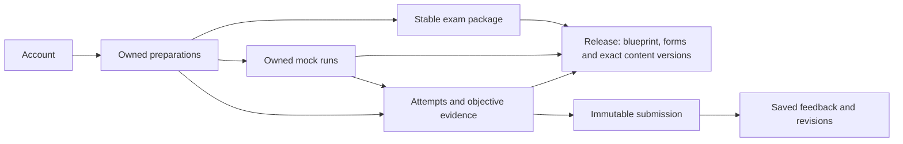
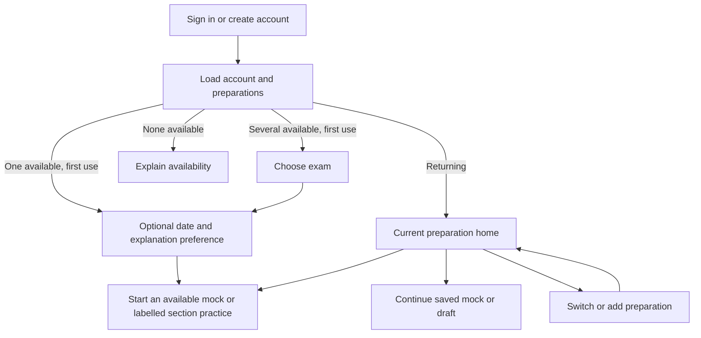

# Adopted multi-exam preparation architecture: telc B1, DTZ and later languages

Assessment **EXAM-ARCH-20261002-A** used source **c06a087a7b74d8d25266ec347fa32fa34c27f935**. Adoption **EXAM-ADOPT-20261002-A**, 2 October 2026, incorporates [Claude's review and the coordinator's dispositions](CLAUDE-MULTI-EXAM-REVIEW-20261002.md). **Status: adopted product and architecture plan; implementation and content release remain pending.**

Ron: "we are only delivering mock exams as part of a preparation effort not a true exam lets adopt the recommendations from claude".

Ron then fixed three release defaults: "no we will release dtz fully , listening playback in practice once and exam mode once . Credit is for one exam only". **DTZ has one complete supported written-package release**, with reading, listening and writing together. Incremental internal development is not a partial learner release. Each DTZ recording plays once per attempt in both practice and mock-exam mode. Credits belong to one selected exam package; they are not pooled across exams.

Hatoove provides original mock exams and supporting section practice for preparation. It does not administer official examinations, certify proficiency or predict an overall pass. Official formats guide useful practice; they do not require proctoring, identity checks for certification or an official examination delivery system. A coherent saved mock run is the primary journey, with explanations and targeted revision afterwards. Section practice remains useful while the complete supported written mock is being assembled; its scope must be explicit.

## Recommendation

Keep one Hatoove application, the vanilla client, the Node server/worker and one shared PostgreSQL schema. Extend the existing exam-package foundation rather than building a separate DTZ application. Separate three concepts explicitly:

1. **The account** owns identity, account preferences and data rights.
2. **A preparation** is that person's work toward a stable exam identity, with its own optional date, saved work and history. It is not pinned to a blueprint revision.
3. **A versioned exam package** defines that exam's structure, allowed task types, content references, assessment contracts and actual available features.

One account can hold several preparations. The interface shows one active preparation at a time. A returning learner resumes directly. First use skips the chooser when exactly one package is available, shows an explicit choice when several are available and explains unavailability when none are available. Always show the selected exam name. A future language is another package, not a translation of German questions or a fork of the application.

The existing database already records exam identities, immutable task/rubric versions and session-derived ownership. However, **adding DTZ rows or a dropdown now is insufficient**: the shipped journey has no exam selection, settings hold one exam date, several queries default to all exams, and client/worker contracts assume telc. Fix those seams before making a second package available.

Speaking/STT, overall-exam pass predictions, production deployment and live-provider activation remain excluded. [D9](D9-EXAM-PACKAGES.md) records telc Deutsch B1 first, DTZ as the next package to implement and English exams as later candidates. Adoption is not educational approval of content. The existing labelled internal preview stays available under an explicit server-enforced preview policy; public releases require approved content and rights evidence.

## 1. What DTZ changes

The package should be named **Deutsch-Test für Zuwanderer (DTZ), A2–B1**, with B1 selectable as the learner's goal. Do not call the exam itself a B1-only variant. g.a.s.t. administers DTZ; its identity must not depend on an old provider label. Keep exam identity, administrator and historical source provenance separate.

| Property | telc Deutsch B1 | DTZ A2–B1 | Consequence for Hatoove |
|---|---|---|---|
| Level model | B1 | Scaled A2–B1 | Store a level model/range and optional learner goal; never infer exam identity from `B1` alone. |
| Reading | 3 parts, 20 items | 5 parts, 25 items | Section/part definitions and supported task shapes come from the selected blueprint. |
| Language elements | Separate 2-part section, 20 items | No separate section | Do not show a DTZ Sprachbausteine exam tile. General grammar drills can remain labelled supporting practice. |
| Listening | 3 parts, 20 items | 4 parts, 20 items | Bind each set to its own audio and playback rules; do not reuse telc listening assumptions. |
| Playback in the published model | Once, twice, twice across the three parts | Once for each recording | Store policy per part. Ron selected one DTZ play per recording in both practice and mock-exam mode; do not introduce assisted DTZ replay. |
| Written timing | Reading/language elements share 90 minutes; listening about 30; writing 30 | Listening about 25; reading 45; writing 30 minutes | Model ordered sections and shared time groups, not a universal duration per skill. |
| Writing task | One assigned task with four content points | Choice between two tasks, each with four content points | A section drill may select a task directly; a mock form preserves the A/B choice and selected prompt binding. |
| Writing criteria | 3 criteria | 4 criteria | DTZ needs its own rubric, feedback schema, validation fixtures and educational review. The retired internal four-criterion rubric is not a DTZ rubric. |
| Overall result | Includes oral performance | Includes oral performance | Written practice cannot produce a whole-exam pass prediction for either package. |

Sources: [telc exam overview](https://www.telc.net/sprachpruefungen/deutsch/zertifikat-deutsch-telc-deutsch-b1/), [telc official model](https://shop.telc.net/media/catalog/product/file/telc_deutsch_b1_zd_uebungstest_1.pdf), [g.a.s.t. DTZ overview](https://www.gast.de/de/forschung-entwicklung/entwicklung/auftraege/deutsch-test-fuer-zuwanderer-dtz/der-dtz-auf-einen-blick), [DTZ official practice set 1](https://www.gast.de/fileadmin/gast.de/GAST/5_DTZ/PDF/gast_DTZ_UEbungssatz_1.pdf), [g.a.s.t. FAQ](https://www.gast.de/de/forschung-entwicklung/entwicklung/auftraege/deutsch-test-fuer-zuwanderer-dtz/faq). Source checks are format research, not qualified approval of Hatoove content.

DTZ's writing dimensions are task fulfilment, communicative organisation, accuracy and vocabulary. Preserve their distinct criterion IDs and descriptors. Do not reuse telc bands or convert telc feedback into DTZ results. Display practice feedback without an overall total; any future numeric/level assessment requires its own evaluated contract. Fixed, rights-cleared listening recordings are required before listening is offered. Device-local read-aloud of explanations does not satisfy that requirement.

DTZ adds a concrete renderer requirement: reading part 3 and listening part 3 combine true/false and multiple-choice questions under shared stimuli. Reading part 5 is a six-item multiple-choice cloze, not a separate language-elements section. DTZ writing uses six rubric positions rather than telc's four A–D positions; the [detailed second official practice set, printed pp.42–43](https://www.gast.de/fileadmin/gast.de/GAST/5_DTZ/PDF/gast_DTZ_UEbungssatz_2.pdf#page=42) is the contract source. The current FAQ sets no minimum word count and permits an appropriate, consistent informal address; do not invent a word-count threshold or universal formal-address rule. These facts need assessment fixtures, not just new labels.

Evidence limits: DTZ task structure was cross-checked between official practice sets and current provider pages. The overview's abbreviated writing labels differ from the detailed rubric/FAQ; use the detailed contract. The accessible telc model is the 2020 printed edition, consistent at the broad-format level with its current page. Qualified review should confirm format fidelity before releasing a format-matched mock. This is a content-quality gate, not certification of Hatoove as an official exam provider. PDF text was checked; independent visual inspection of those tables was not established by this assessment.

## 2. Current architecture: useful foundations and blocking gaps

Paths and line references below refer to the assessed source, not an implemented design.

| Area | Existing foundation | Required change before DTZ activation |
|---|---|---|
| Identity and ownership | Verified sessions, row-level ownership, account-change fencing and durable saved work | Retain those protections; add preparation ownership and account/preparation context to new paths. |
| Package metadata | `server/migrations/0009-exam-scope.sql:23` defines `exam_package`; content, tasks and rubrics carry `exam_id` | Add immutable runtime-validated blueprint versions and an explicit release/availability record. A text `blueprint_version` field is not a validated blueprint contract. |
| Preferences | `server/owned-postgres/settings.mjs:141` reads one account-wide `exam_date` | Move the exam date into preparation records. Keep theme and default explanation preference on the account. |
| Discovery | `server/owned-api.mjs:729` and datastore queries already accept an exam filter | Require explicit preparation context for practice. Null must not silently mean all packages in learner practice or progress. |
| Part vocabulary | `server/owned-api.mjs:202` fixes LV1–3, SB1–2 and HV1–3 | Replace the global telc part parser with package-defined part identities and validation. DTZ reading part 5 must be valid only within its package. |
| Objective progress | `server/owned-postgres/adapter.mjs:548` and `:639` optionally filter exam and aggregate by section | Scope recommendations, mistakes and denominators to preparation/package/version and comparable task definitions. |
| Objective version binding | `public/app/app.js:631` opens by set ID; `public/app/api.js:151` defaults reads to `v1`; adapter seen/mistake keys at `:601` and `:685` omit version | Carry the exact set version from discovery through read and answer. Keep evidence version-specific unless an explicit reviewed equivalence mapping exists. |
| Writing assessment | `server/owned-postgres/worker.mjs:53` resolves only imported telc/legacy rubric constants; `server/worker.mjs:79` uses a deterministic stub | Resolve the exact package/task/rubric and supported assessment policy before grading. Supply the immutable prompt, selected task variant and required descriptors to the grader. Keep live evaluation gates. |
| Feedback validation | Worker validates against bound rubric, but obtains band keys from the first criterion (`:233`) | Validate each criterion against its own scale and schema; unknown policies fail before any provider call. |
| Client | Shared API module and reusable writing controller; fixed telc section names and feedback copy in `public/app/app.js:45` and `:791` | Introduce exam context, catalogue-driven navigation, renderer registry and rubric-specific display metadata. |
| Entry | `public/auth/entry.js:110` redirects to `/app/` | Bootstrap saved preparations; choose exam on first use and resume on later visits. |
| Practice entry actions | `public/app/app.js:275` and `:403` show informational writing/recommendation cards without a direct start action | Make Start/Continue open the exact available versioned task. A chooser followed by an inert card would still leave the requested journey incomplete. |
| Content maintenance | Reproducible generators such as `tools/build-objective-migration.mjs` split public content from private keys | Standardise a package manifest/import pipeline; ordinary new questions should not require hand-editing application code or one schema migration per content batch. |
| Publication and withdrawal | `server/content-policy.mjs:2` defaults to approved plus unreviewed generated material; `0020-content-rights.sql:24` permits one immutable rights decision per content version | Add explicit package/section release gates and append-only decision identities so later review or revocation is possible. Seeding DTZ must not publish it. |
| Reference resources | Vocabulary/noun/guide schemas in migrations 0011–0013 contain language-specific shapes and limited versioning | Introduce versioned language-tagged resources incrementally; German noun gender is not a universal exam feature. |

These are second-package contract gaps, not evidence of a cross-account leak. Version-default and criterion-scale assumptions are extension risks: current objective content uses v1 and current telc criteria share a scale. Bootstrap ordering is a preference/context rendering race, not a missing initial session check. The approved-plus-unreviewed policy is deliberate for the current labelled internal pilot. S0 addresses these distinctions without claiming every item is a reproduced live failure.

## 3. Recommended data boundaries

Use relational columns for identity, ownership, version references, availability and query filters. Use validated JSON payloads for task-specific stimuli and responses. Do not turn the schema into one unvalidated content blob or create a database/schema per exam.

| Concept | Responsibility and invariants |
|---|---|
| `exam_package` (extend existing) | Stable exam ID, official name/aliases, administrator, exam language and level model. Names are display data, not keys. Support fixed CEFR levels, CEFR ranges and future band-scale exams without pretending every test is B1. |
| `exam_package_version` (new) | Immutable blueprint, source revision, ordered sections/parts/time groups, task-type contracts, assessment policy versions and declared supported scope. Explicit compatibility version. |
| `package_release` (new) | One minimal manifest: exam ID, blueprint version, exact content/form/rubric/media membership, per-section state (`hidden`, `internal`, `available`, `withdrawn`), publisher, hash and timestamp. Immutable manifest revisions retain publication history; a small active-release pointer selects new work. Rights and review decisions remain separately attributable. No generic targeting or rollout platform. |
| `learner_preparation` (new, owned) | Account ID and stable exam ID, optional target level, local calendar exam date, lifecycle state and optimistic revision. No mandatory blueprint pin or blueprint-upgrade lifecycle. A preparation can be archived without deleting work. Start with one open preparation per account/exam; retain an ID so retakes can later be separate cycles. A date alone needs no timezone; add one only if scheduling an actual time becomes a requirement. |
| Exam entitlement/credit ledger (extend existing) | Account + exact exam ID, allowance and usage entries. Server validates the submission/run exam against its entitlement and records one successful debit. No cross-exam transfer, pooling or extra allowance from another preparation. |
| Mock form (versioned content) | A validated form within the package content manifest: ordered sections/time groups, exact task/set versions, writing-choice groups, timing/playback/assistance profile and scope (`section` or `complete_supported_written`). It is not another publication system. A dedicated table is optional if protected manifest references suffice. |
| `mock_run` (new, owned) | Preparation, exact form/release/blueprint references, mode and timing policy, saved responses, current position, selected writing option and child attempt/submission IDs. Stable identity, optimistic revision and idempotent start/finalise. Run completion and assessment status are distinct. |
| Account preferences (extend existing) | Theme, default explanation language, future interface locale and last-used preparation hint. Last-used is navigation convenience, never the authority for an existing attempt. |
| Existing tasks/sets/rubrics/assets | Exact immutable versions bound to their exam and blueprint. Stable globally unique IDs or namespaced IDs; composite foreign keys/checks must prevent cross-exam task/rubric/content combinations. |
| Existing attempts/evidence/submissions/results | Add preparation association and authoritative package binding. Each attempt retains exact task, rubric, policy, content/media and blueprint versions; submissions retain exact text and explanation language. |
| Translations/reference resources | Language-specific versions and review status. Reusable German grammar can be tagged for applicable packages; its completion is not automatically counted as exam-part performance. |



Keep these choices independent: **exam**, **exam language**, **interface language**, **explanation language**, **purchasing market**. German remains the current interface language; adding DTZ does not authorise a full multilingual-shell project. Existing de/en/uk/ar/tr explanation preferences remain separate, with scoped Arabic RTL. Changing an explanation preference never changes the exam or silently regrades an old submission. A future market/currency decision is not inferred from a language or IP address.

A preparation references the stable exam. Resolve the active compatible release for each new attempt or mock run and pin its exact versions there. Do not resolve "latest" again when resuming. An incompatible format change or booked variant requires an explicit choice before new work; it must not silently move the learner to a different format. This exception does not require a blueprint-upgrade workflow for ordinary content updates. Retain a safe historical reader when content is withdrawn; exceptional legal takedown rules require their own policy.

**Minimal mock contract:** save answers without disclosing correctness during a timed mock; reveal marking/explanations at the form's declared submission boundary. Current immediate-feedback practice remains a separate mode. Acknowledged responses survive reload, another device and exam switching. A run keeps its selected form, task order, writing choice and media versions. New retakes receive new run IDs; retries of start/finalise must not create another run, evidence row, submission or allowance debit. Finalisation atomically freezes responses and creates the applicable assessment work; stale-tab writes fail by revision. Unanswered items remain explicitly unanswered. A submitted run may have pending, failed or unassessed writing feedback without losing its completed objective work.

For a timed mock, persist server timestamps and the declared shared time budgets. Leaving or disconnecting does not silently reset or pause the clock; on return, enforce the persisted deadline and explain any expiry. An explicitly paused/assisted mode is separately labelled and records that policy. **DTZ playback is once per recording per attempt in both practice and mock-exam mode**, including across refresh, exam switches, tabs and device return. Persist playback progress/consumption: a failed load before playback does not consume a play, an interrupted play resumes from the saved position under the same allowance, and uncertain progress has an explicit recovery state rather than silently granting a restart. This is preparation timing/playback, with no proctoring or anti-cheat project. Ordinary withdrawal prevents new starts while preserving existing run resume/history; exceptional rights restrictions block affected use with an explanation and retain responses, never silently substitute content. Complete written mocks require every target written section and reviewed audio. Internal partial forms are labelled section practice/partial mocks; DTZ is not released to learners until the entire supported written package is ready. Oral coverage remains excluded.

Playback is one durable playback ID per run/attempt and recording, not one HTTP request. Range/buffer requests resume that playback; a second tab cannot claim a fresh allowance for the same recording in that attempt. The player prevents replay/backward seek within that attempt. Persisted progress and explicit uncertain-position recovery provide ordinary UX enforcement, not DRM or proof of exactly what a learner heard. A new practice attempt is separately identified; changing a mode or refreshing the same attempt cannot reset its allowance.

Credits/allowances are server-owned and **bound to one selected exam package**. A telc credit cannot pay for DTZ, or vice versa; switching, archiving or creating another preparation never transfers, mints or refills credits. The UI shows the selected exam's balance and a clear unavailable/exhausted state. Server-side start/submission/assessment checks use the work's immutable exam identity, not the current header selection. Each successful chargeable assessment records at most one debit against its exam entitlement; reservations, debits and any refunds retain that binding, failures do not consume successful-review credits, and late jobs retain their original exam. The unit/price/quantity of an eventual offer is not changed here. This is package scoping, not a new payment integration or a charge for every navigation/retry. Count/classify existing balances and debits before an audited telc backfill; never erase ambiguous balances or create credit for DTZ from an old global allowance.

At the database boundary, consider `UNIQUE(preparation_id, owner_id, exam_id)` with a matching foreign key from new work, plus same-exam task/content/rubric references and the exact task-to-rubric tuple. Preserve existing IDs, including unprefixed historical `writing.*`; namespace new content. Avoid storing duplicate immutable facts when a protected reference already proves them. Use a nullable SQL `date` for the preparation date and calendar-valid input checks; the current settings string regex alone does not reject impossible dates.

## 4. Application and API structure

Use a modular monolith: authentication/accounts, exam catalogue, preparations, practice, assessment and content publishing are code modules within the same deployment. Keep Docker Compose and the current server/worker. Neither microservices, a new framework nor a plugin execution platform is needed.

**Shared practice engine, declarative packages.** A package selects tested capabilities such as single choice, matching, bank gap-fill, inline gap-fill, grouped questions, fixed audio and extended writing. Each renderer/answer schema/marker is versioned and registered in code. Exam-specific IDs and labels map to those capabilities. Packages do not contain executable JavaScript, SQL or arbitrary scoring expressions. A genuinely new interaction type requires a reviewed renderer and server validator; adding more content of a supported type does not.

Carve `public/app/app.js` into bounded vanilla modules as the features are touched: bootstrap/router, preparation context, exam chooser, dashboard, practice catalogue, objective renderer registry, history and preferences. Keep `api.js` as the sole transport owner and retain the writing controller's save/conflict/submission guarantees. Do not rewrite all views first.

Proposed resource shape, to formalise in the API contract before implementation:

| Resource | Purpose |
|---|---|
| `GET /api/v1/bootstrap` | Verified account, preferences, owned preparations and permitted catalogue summary; distinguish empty setup from unavailable service. |
| `GET /api/v1/exams` | Package summaries, recognisable target exam names, level model and actual mock/section availability. Add search/filtering when catalogue size warrants it. No answer keys or hidden content. |
| `POST /api/v1/preparations` | Idempotently create an owned preparation after validating package availability. Session supplies owner; date optional. |
| `GET/PATCH /api/v1/preparations/:id` | Read/update the owned date, goal or archive state using an expected revision. No reassignment of an existing preparation's exam. |
| `/api/v1/preparations/:id/{tasks,practice,next,progress,mistakes,history}` | Explicitly scoped discovery and practice resources; final route names to consolidate with existing routes. Paginated lists. |
| `/api/v1/preparations/:id/mock-forms` and `POST .../mock-runs` | Discover eligible full/section forms and idempotently start a run, resolving exact released versions on the server. |
| `/api/v1/mock-runs/:id` and response/finalise operations | Owner-checked resume, revision-checked response saves and idempotent finalisation. Route names and response granularity settle in the contract; timed responses must not leak correctness through immediate-marking endpoints. |
| Existing attempt/submission endpoints | IDs resolve ownership, preparation and immutable task binding server-side. No dependence on a global active-exam preference. |

Creation validates the full tuple: preparation owner + package + blueprint + task version + rubric/marker + release policy + applicable exam-bound entitlement. An authenticated account alone is not enough to make an arbitrary task valid for the selected preparation. Returning 404 for another owner's preparation must preserve the current non-enumeration contract.

Use explicit route context such as `/app/#/prep/<id>/practice`; existing hash-based deployment needs no hosting migration. A browser tab keeps its own preparation context. The last-used preference helps a fresh browser, but switching in tab A must not retarget tab B's saved draft. Extend the current account-generation fence with a preparation/navigation generation and cancellation of obsolete reads/polls. Server jobs continue against their original immutable submission.

Bootstrap must resolve account, preferences and preparation before dispatching a practice view; the current `route()` precedes awaited settings refresh in `public/app/app.js:1070`, although session verification already runs first. A same-view exam switch needs its own context generation because checking the view name alone cannot reject the old result. An explicit, validated relative deep link wins over the last-used hint after sign-in; do not introduce an arbitrary external return URL. Add cursor pagination and indexes for owner/preparation/time, exam/blueprint/task family and release membership as the corresponding queries are introduced, rather than downloading whole banks for client-side filtering.

Retain the existing verified-session handshake before calling the owned bootstrap endpoint: `createApi` deliberately refuses unbound `/api/v1` requests. Bootstrap is a domain-data read after identity binding, not a way to bypass the account fence.

## 5. Learner experience



**First use:** if only telc is available, idempotently create/reuse that preparation and show its name without a one-option chooser. With two available packages, show clear cards: “telc Deutsch B1” and “DTZ · Deutsch-Test für Zuwanderer · A2–B1”. Explain the distinction and each package's actual available scope. An “Ich bin nicht sicher” link compares names/formats and suggests checking booking/course documentation; never guess from nationality or explanation language. Require an explicit choice when multiple exams are available. Keep date optional (“Noch kein Termin”) and reuse the explanation preference; neither blocks practice. Offer “Probeprüfung starten” only for an available form, with its scope and mode visible. Until a full written mock is available, label the action as section practice. No diagnostic, daily-time setting or study plan is required.

**Returning learner:** bypass repeated onboarding. The home names the exam and prioritises “Probeprüfung fortsetzen” for a saved run, then saved drafts and feedback. Starting a fresh mock is distinct from resuming one. A submitted run shows objective results and writing pending/failed/unassessed as appropriate; this does not imply an official result or a combined writing score. Explain mistakes and offer targeted section revision after submission. Show factual activity only; no readiness, streaks or invented completion percentages.

**Navigation:** a persistent exam name/switcher in the desktop header and mobile header/sheet. Primary destinations remain consistent: Heute, Üben, Verlauf, Mehr. The selected package supplies the skills inside Üben. DTZ releases Lesen, Hören and Schreiben together, including reviewed fixed audio; grammar/reference resources are supporting practice. Do not offer an incomplete DTZ package with listening marked "coming soon". Exam-specific credit/access status stays visible, and an exhausted DTZ balance cannot consume telc credit. Unavailable content/access explains its status rather than opening an empty exercise.

**More exams later:** with two choices use cards, not a search form. As the catalogue grows, progressively add exam-language filters, search and provider/level refinements. Remember enrolled preparations at the top. Do not use country flags as language identifiers, flatten everything into a long dropdown or make a learner select an administrator before seeing a recognisable exam name.

**Switching and recovery:**

- Normally autosave and switch after acknowledgement, with no confirmation dialog on every switch. During a mock, save its position/responses and retain its timing policy. On failure, conflict or uncertain response, keep the old context and text visible and offer retry/stay/copy recovery. Explicitly abandoning local unsaved edits retains the last server-saved draft; switching must never call draft DELETE.
- A lost save response or revision conflict also leaves the old context visible until resolved. Deleting a saved draft is a separate explicit action; server refusal still wins if another tab has already submitted it. Switching exams never bypasses the submitted-draft preservation rule.
- Submitted writing: keep its original exam label, pending/error status and history. Switching cannot cancel grading, duplicate the debit or reinterpret the rubric.
- Old links and two tabs: open the preparation belonging to the referenced attempt after ownership validation; show that context clearly. Ignore late results from the previous view.
- Archived/withdrawn package: allow historical access according to policy; offer an explicit supported destination for new practice. No silent task substitution.
- Empty or blocked catalogue: distinguish no matching content, unavailable service, unavailable audio and review/access restrictions. Never show a misleading Start button.
- Account export/deletion: describe account-wide scope across all preparations, mock runs, responses and feedback. Archive preparation is a separate reversible action, not account deletion.

Use the supplied orange/warm-paper design system and licensed fonts. `design/screens/onboarding.html` already suggests a useful two-card layout, but its plan/readiness/daily-time claims are excluded. Acceptance includes keyboard focus, screen-reader labels, 320/390px layouts, text zoom, long exam names, light/dark themes, Arabic explanation blocks and actual iPhone/Android keyboard/audio checks. No new UI is claimed by this document.

Keep full objective answer text visible on touch screens; the current 40-character truncation plus hover title (`public/app/app.js:695`) is unsuitable for choosing between long answers. Do not hide the exam name inside a desktop-only sidebar. History defaults to the active preparation; an explicit all-preparations view may group labelled records without aggregating incompatible results. A past exam date invites an optional update and does not block practice. Define save/resume rights for existing drafts when access or publication changes before implementing that recovery state.

## 6. Maintainable content operations

Begin with version-controlled structured source and a validated import command; a bespoke administration CMS is not a prerequisite. Retain the database and API as runtime authority. A future editorial UI should call the same validation/publishing service rather than introduce another data format.

Suggested source organisation:

```text
content/exams/<exam-id>/manifest.json
content/exams/<exam-id>/blueprints/<version>.json
content/exams/<exam-id>/mock-forms/<form-id>/<version>.json
content/exams/<exam-id>/tasks/<family>/<task-id>/<version>.json
content/exams/<exam-id>/rubrics/<rubric-id>/<version>.json
content/exams/<exam-id>/locales/<language>/...
content/exams/<exam-id>/media/manifest.json
```

Keys and protected transcripts remain private import inputs, separated from public payloads; they must never enter public assets or learner DTOs. The repository is already private: this boundary does not require a new encrypted store. Test public builds, static routes and DTOs for exclusion. Shared resources have explicit applicability and source identity rather than copied text across packages. Current media support is generic static serving, and `/assets/**` is anonymous. EXAM-S5 must implement and validate a version-aware media route within the existing Node server, including rights/release/access checks, checksums and range/playback support. No new hosting service is needed.

The pipeline is **author → validate → qualified educational review → translation/audio/rights review → preview → publish a content release → monitor or withdraw**. Keep these approvals separate and tied to exact hashes. Agents may draft and validate, not grant educational approval. Public official model PDFs establish specifications, not blanket republication rights.

Validation covers schema/version support, unique identities, exact referenced versions, exam/blueprint coherence, answer keys, option/matching constraints, mock-form coverage and task counts, timing/choice groups, rubric criteria/scales, source/rights records, translation coverage, asset existence/hash/duration and accessibility metadata. A form labelled complete written must contain every written section of the declared exam format, including listening; absence is not resolved by redefining "supported". Publish transactionally using a privileged content publisher, never the learner runtime role. Identical imports are idempotent; different bytes under the same version are rejected. Expose a dry-run diff and audit receipt. Avoid selecting “latest” using lexical version sorting; releases name explicit versions.

The release manifest is the only package publication contract. Server policy enforces `hidden`/`internal`/`available`/`withdrawn`; browser flags cannot grant access. Labelled internal preview may retain the current generated/unreviewed telc corpus. Learner availability requires exact-version educational and rights approval, including every member of a mock form. **DTZ transitions to available as a complete supported written package atomically:** reviewed reading, writing, listening/audio, complete forms and recovery/assessment contracts must all pass. A complete-form label alone is insufficient if another required section is still unavailable. Partial DTZ fixtures remain internal and cannot be exposed by a section route or direct ID. Loss of a required section makes that DTZ release unavailable for all new learner starts, including direct section starts, instead of silently creating a partial offer. Permitted existing resume/history remains distinct under the withdrawal policy and retains saved evidence.

Schema migrations remain for schema changes. Preserve all applied historical seed migrations and their checksums. Transition future content batches to the importer without rewriting existing rows, hashes or provenance. Editorial reports should expose coverage by package/section/task family, review status and language, so expanding a corpus is a content operation rather than a hunt through SQL and client code.

## 7. Safe delivery sequence

| Slice | Deliverable | Acceptance before proceeding |
|---|---|---|
| EXAM-S0: harden existing contracts | Exact objective versions and version-specific evidence, preference/context bootstrap ordering, criterion-specific validation; specify internal versus public release policy | Discriminating v2 and per-criterion-scale fixtures, delayed settings/session tests, preserved labelled internal preview, public approved-only policy tests. No claim that all gaps already cause live failures. |
| EXAM-S1: telc preparation journey | Stable exam-bound preparation, optional date, proportionate record/credit backfill, exam-scoped entitlements and APIs, bootstrap/routes, Start/Continue for current section practice, history/export/delete | Working telc journey with no single-option chooser, two-owner/exam-entitlement negatives, synthetic upgrade preservation and fresh-browser resume. Independently reviewed desktop/mobile evidence; no full-mock label yet. |
| EXAM-S2: minimal package and telc mock run | Extract telc blueprint, one release manifest/importer, versioned form and owned run contract; first coherent telc section mock with deferred feedback, save/finalise/resume | End-to-end telc section mock before adding DTZ; retries/tab races and unchanged historical work proved on disposable PostgreSQL. Offline DTZ fixture plus a tiny language/scale contract fixture validate. Begin original DTZ authoring/review on settled schemas. |
| EXAM-S3: internal DTZ reading | Original reviewed set, grouped/mixed questions and cloze, version-exact marking, DTZ reading form/run, two-exam chooser and autosave-first switch exercised in isolated fixtures | Internal login → choose → start → resume → submit → review; independent tabs and failed-save recovery. No learner DTZ release until S5/S6 complete the full written package. |
| EXAM-S4: internal DTZ writing | A/B choice group and immutable selected prompt, four-criterion policy, preserved drafts/submissions/revisions, writing attached to mock runs | Each criterion uses its own scale; no telc relabelling. Submitted mock survives pending/failed/unassessed writing and debits only its exam entitlement. Still internal; simulation labelled, live grading behind evaluation/privacy/cost gates. |
| EXAM-S5: fixed listening and complete written mocks | Version-aware media route, reviewed recordings, per-part playback/timing, listening recovery for both packages; assemble all target written sections | DTZ once per recording in both modes, persisted across interruption/return. Reviewed full form coverage/audio and real-device evidence; complete DTZ candidate retained internally for S6. No oral/official-result claim. |
| EXAM-S6: complete DTZ release acceptance | Cross-package start/resume/submit/results/revision/history, exam-bound credits and recovery; complete content/release inventory | All DTZ reading/writing/listening gates pass together before learner availability. Independent review and green relevant CI, with human content, legal/security/provider and physical-device gates separate. Release decision remains distinct from production deployment authorization. |

EXAM-S0–S6 supersede the original horizontal EXAM-01–06 proposal. Deliver telc first, then DTZ reading, writing and listening as vertical slices. Desktop/mobile, keyboard, accessibility and applicable real-device checks belong to each changed learner flow, not just S6. Defer third-package implementation; a tiny non-German/alternative-scale schema fixture guards independence without building another product. Content authoring/review can run alongside later client work once task/rubric schemas are fixed. No time estimate is asserted before the inventory and review capacity are known.

For migration, count and classify actual records first. Where all identities are provably telc, use a simple audited backfill with preserved dates; do not build a generic mapping engine in advance. Those learners skip first-time onboarding. Old standalone answers must not be fabricated into completed mock runs. Include balances/debits in the inventory and preserve exam-scoped totals. Never infer ownership or exam from a global preference alone. Ambiguous bindings stay unresolved and readable; never guess or erase them. Empty accounts skip selection with one available exam and choose explicitly with several. Use nullable additions/backfill/verification before tightening constraints, transactional writes, a backup and a dry run. Preserve old preference values through rollout. If immutable historical rows cannot accept a binding, add a separately verified mapping only where required rather than disabling protection. Rollback disables new selection/releases while retaining data. Prove concurrency and idempotence on synthetic records before any live migration.

## 8. Discriminating acceptance tests

1. One learner creates telc and DTZ preparations with different dates. Switching cannot change either date, task list, results or history. Another learner cannot read or mutate them by ID.
2. A DTZ preparation rejects a telc task/rubric, forged exam ID, missing context and unsupported blueprint. Database constraints also reject incompatible content tuples.
3. DTZ reading part 5 is accepted for DTZ and rejected for telc. Mixed task shapes and writing choice persist the exact selected variant.
4. A delayed telc response cannot populate the DTZ screen. Two tabs may practise different exams; changing a last-used hint does not retarget either tab.
5. A dirty draft survives refused/failed switching, session expiry and lost save response. Pending submission continues once and is shown under its original exam with unchanged usage accounting.
6. New package/content versions affect new work only. Old submissions, rubric labels, audio references and feedback remain exact; withdrawn content cannot start a new attempt.
7. Progress and mistakes are isolated per preparation and comparable policy version. No cross-rubric average, overall pass label or grammar-drill-as-exam-completion appears.
8. Changing explanation language preserves German/English exam text and saved assessment identity. Missing translations are explicit; Arabic direction does not leak into the rest of the screen.
9. Importing twice is idempotent; changed bytes under an existing version fail. Learners cannot enable hidden/internal releases or promote unreviewed content to availability. Incomplete DTZ releases fail atomically, including direct section/ID access; all required sections pass together. Public DTOs contain no keys or protected transcripts.
10. Account export includes all preparations and retained work; hard delete removes all owned rows, revokes sessions and cannot be undone by a late job. Creating a preparation does not replenish credits.
11. A tiny contract fixture accepts a non-German language and alternative scale without German core constants. No third package or renderer is built for this test. A genuinely new interaction still requires explicit renderer/validator registration.
12. A telc section mock retains its form, order, selected writing option, answers, deadlines and versions across refresh, new device and exam switch. Correctness cannot leak before its declared submission boundary. Retake creates a new run; start/finalise retries create no duplicate evidence, grading jobs or debit. Stale-tab saves cannot change a finalised run.
13. Completed objective work remains readable while writing is pending, failed or unassessed. Timing expiry, unanswered questions, ordinary withdrawal and rights-blocked resume have explicit, lossless states. No failed assessment becomes an invented score.
14. Full written mock validation requires every target written section, including reviewed audio. DTZ consumes one play per recording in both practice and mock-exam mode; refresh, switches, another tab/device and range retries cannot grant another play. Failed pre-play load does not consume it; interrupted/uncertain playback has explicit recovery. Returning never resets the timed clock. New releases do not change existing runs.
15. A telc entitlement cannot fund DTZ and vice versa. Creating, archiving, switching or resuming preparations never transfers/refills credits. Duplicate finalisation/worker retries debit at most once from the original exam, including after the header selection changes; failed assessments preserve credits. Credit backfill reconciles original totals without inventing DTZ allowance.

All executable checks must use source-only fixtures, synthetic learners and isolated ports/databases, never the existing learner preview. This assessment runs no live provider, email, payment or migration operations.

## Adopted defaults and next implementation

Adopted defaults are original mocks for preparation, multiple saved preparations with one visible at a time, optional preparation dates, stable exam binding with exact versions on runs/attempts, DTZ labelled A2–B1 with a B1 goal, unchanged German interface and existing explanation languages, content files/importer before a CMS and one release manifest. **Release DTZ fully for the supported written scope; each DTZ recording plays once in both practice and mock mode; credit belongs to one exam package only.** Internal vertical development does not authorise a partial DTZ release. No official exam delivery, certificate, overall pass prediction or speaking promise is introduced.

The next engineering slice is **EXAM-S0**, followed by the telc journey in **S1** and the first saved section mock in **S2**. Each needs its own bounded implementation assignment. Human review of content and existing release gates remain necessary. Adoption does not claim the new browser journey, DTZ content or mock engine already exists.

## Assessment verification

The coordinator authored this proposal after three bounded read-only audits at the source pin above. Independent backend/architecture, client/UX and official-format reviewers approved their respective proposal scopes with no blocking findings. Their clarifications are incorporated: date-only storage, a media route still to implement, preserved session binding, local-edit discard distinct from draft deletion, and approximate listening duration. Format research is not human educational approval.

EXAM-ADOPT also aligns the pilot plan, master plan, D9, Claude-review disposition, implementation plan and board with Ron's mock-preparation clarification. Independent architecture and learner-journey review is required for this adoption diff. No application test result, new rendered UI evidence, live migration, provider evaluation or implemented multi-exam journey is claimed by these documentation changes. Prior pilot evidence remains in its separate integration report.
